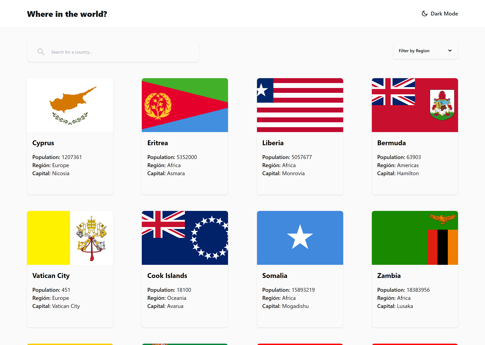

# Mentor de interfaz de usuario: API de países REST con solución de cambio de tema de color

Esta es una solución para el desafío [API de países REST con cambio de tema de color en Frontend Mentor](https://www.frontendmentor.io/challenges/rest-countries-api-with-color-theme-switcher-5cacc469fec04111f7b848ca). Los desafíos de Frontend Mentor lo ayudan a mejorar sus habilidades de codificación mediante la creación de proyectos realistas.

## Tabla de contenido

- [Resumen](#descripcion-general)
  - [El desafío](#el-reto)
  - [Captura de pantalla](#captura-de-pantalla)
  - [Enlaces](#enlaces)
- [Mi proceso](#mi-proceso)
  - [Construido con](#construido-con)
  - [Lo que aprendí](#lo-que-aprendí)
  - [Desarrollo continuo](#desarrollo-continuo)
- [Autor](#autor)
- [Agradecimientos](#agradecimientos)

## Descripción general



### El reto

Los usuarios deberían poder:

- Ver todos los países desde la API en la página de inicio
- Busque un país usando un campo de "entrada"
- Filtrar países por región
- Haga clic en un país para ver información más detallada en una página separada
- Haga clic para ir a los países fronterizos en la página de detalles.
- Alternar la combinación de colores entre el modo claro y oscuro _(opcional)_

### Captura de pantalla


### Enlaces

- URL de la solución: [https://github.com/Torres2000/rest-countries-api](https://github.com/Torres2000/rest-countries-api)
- URL del sitio en vivo: [Agregue la URL del sitio en vivo aquí](https://your-live-site-url.com)

## Mi proceso

### Construido con

- Marcado semántico HTML5
- Propiedades personalizadas de CSS
- Caja flexible
- Cuadrícula CSS
- Flujo de trabajo móvil primero
- [Reaccionar] (https://reactjs.org/) - Biblioteca JS
- [Next.js](https://nextjs.org/) - Marco de reacción
- [Componentes con estilo](https://styled-components.com/) - Para estilos

### Lo que aprendí

Aprendi a como mostrar los datos de una api utilizando ReactJS y Next.js

```js
const [data, setData] = useState([]);
const [buscar, setBuscar] = useState("all");

const fetchData = async () => {
  try {
    const response = await fetch("https://restcountries.com/v3.1/" + buscar);
    if (!response.ok) {
      throw new Error("Pais No Encontrado");
    }
    const jsonData = await response.json();
    setData(jsonData);
  } catch (error) {
    alert(error.message);
  }
};

useEffect(() => {
  fetchData();
}, [buscar]);
```

### Desarrollo continuo

Necesito aprender mas sobre el consumo de API en react

## Autor

- Sitio web - [Pedro Torres](https://portafolio-web-dev-jose.netlify.app/)
- Mentor de frontend - [@Torres2000](https://www.frontendmentor.io/profile/Torres2000)

**Nota: elimine esta nota y agregue/elimine/edite las líneas anteriores según los enlaces que desee compartir.**

## Agradecimientos

Solo un saludo a todos los demás creadores de Frontend Mentor. Es una experiencia de aprendizaje maravillosa ver otras soluciones y ver cómo otros codificadores crean lo mismo.
